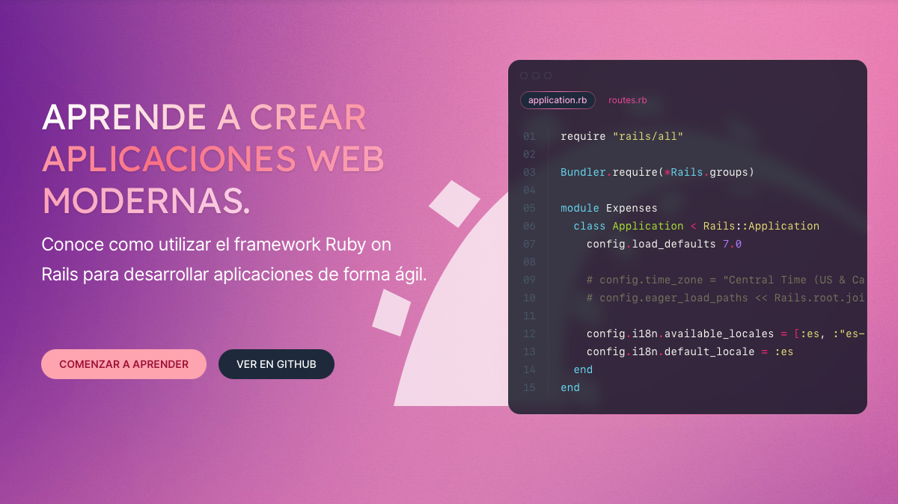

# Aprende a crear aplicaciones Web modernas.



Este repositorio contiene el código fuente de la serie Aprende a crear aplicaciones Web modernas. Para conocer más sobre 
la serie visita el sitio [Aprende a crear aplicaciones Web modernas](https://cursos.mariochavez.io)

El código del repositorio está organizado en __branches__ que corresponden a cada uno de los diferentes videos de la serie.
Puedes revisar el branch __main__ para ver el proyecto completo o navegar a través de las __branches__ para encontrar los
cambios que se fueron realizando en cada video durante el desarrollo de la serie.


## Requisitos 

Para ejecutar la aplicación en tu computadora personal es necesario que cumplas con los siguientes requisitos.

* Versión de Ruby: 3.0 o mejor

* Versión de Ruby on Rails: 7.0 o mejor

Otras dependencias

* Versión de Postgresql:  13.0 o mejor

* Configurar Overmind

## Ejecutar la aplicación.

Después de clonar el repositorio y elegir alguna de las __branches__ es indispensable ejecutar dos comandos para preparar
el entorno.

```bash
$ bin/setup
$ bin/rails db:migrate
```

Una vez que ambos comandos finalizaron exitosamente, para iniciar el servidor de Ruby on Rails debes ejecutar el siguiente 
comando.

```bash
$ overmind start
```

Cuando el servidor complete su proceso de **boot**, abre tu navegador en la dirección http://localhost:3002 para ver la
aplicación.

Si deseas ejecutar la pruebas automáticas de la aplicación, entonces ejecuta el siguiente comando.

```bash
$ bin/rails test
```

Para ejecutar las pruebas, incluyendo el **linter** y las herramientas de auditoría de seguridad ejecuta el siguiente 
comando.

```bash
$ bin/ci
```

---

Derechos reservados ©2022. Mario Alberto Chávez Cárdenas

